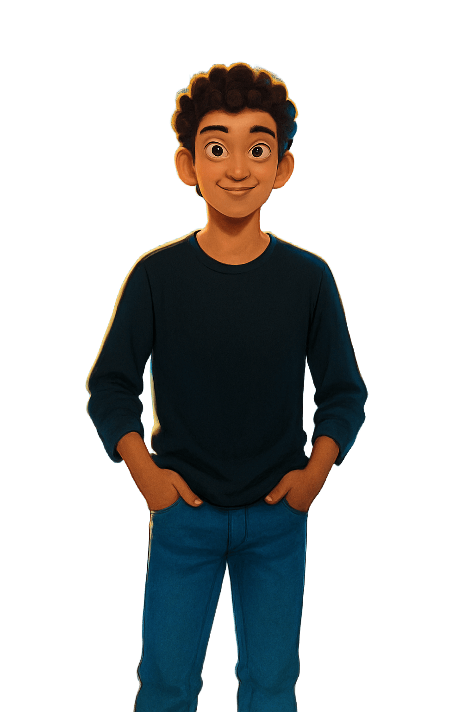

<!DOCTYPE html>
<html lang="en">
<head>
    <meta charset="UTF-8">
    <meta name="viewport" content="width=device-width, initial-scale=1.0">
    <title>Tharindu Dasantha - Portfolio</title>
    <link rel="preconnect" href="https://fonts.googleapis.com">
    <link rel="preconnect" href="https://fonts.gstatic.com" crossorigin>
    <link href="https://fonts.googleapis.com/css2?family=Inter:wght@300;400;500;600;700;800&display=swap" rel="stylesheet">
    <link rel="stylesheet" href="https://cdnjs.cloudflare.com/ajax/libs/font-awesome/6.4.0/css/all.min.css">
    
</head>
<body>
    

        

            

                
            

        

        

            
UI/UX DESIGN • WEB DEVELOPMENT

            

                Tharindu  
                Dasantha
            

            
Full Stack Web Developer

            

                <button>Portfolio</button>
                <button>Behance</button>
            

            <!--  -->
            

            

        

        

            <h2>Who am I ?...</h2>
            

                From Sri Lanka, I'm a dynamic professional excelling as both a <b>UI/UX Designer</b> and <b>Full Stack Developer</b>. My expertise spans <i>Web Development</i>, intuitive <i>UI/UX Design</i>, and robust <i>System Programming</i>, all guided by my belief that "Simplicity is the ultimate sophistication." I'm continuously expanding my knowledge in <b>Advanced React Patterns</b>, <b>System Design</b>, and <b>WebGL</b>, proving that even a `console.log` enthusiast can be a highly skilled developer.
            

            
            

                <i class="fas fa-globe"></i>
            

        

        

            <h3>BRIEF EXPLANATIONS ABOUT MY WORK</h3>
            

                

                    

                        Great software starts with understanding people’s needs. I focus on making user experiences that are not only easy to use but also enjoyable. From first steps to advanced features, I aim for clear, accessible, and smooth interactions. My goal is to turn complex tasks into simple, elegant designs users love.
                    

                    <button>
                        <i class="fas fa-check"></i> Design Philosophy
                    </button>
                

                

                    

                        I focus on building strong, scalable web apps that support modern digital needs. I enjoy designing systems that handle high traffic, adapt over time, and run smoothly. From front-end to back-end, I aim for clean code and smart design that keeps things stable, easy to maintain, and ready to grow.
                    

                    <button>
                        <i class="fas fa-check"></i> Development Focus
                    </button>
                

                

                    

                        I enjoy tackling complex problems and turning them into simple, effective solutions. I start by understanding the root cause, then take a thoughtful, creative approach to solve it. My goal is always to build solutions that work seamlessly in the real world.
                    

                    <button>
                        <i class="fas fa-check"></i> Problem Solver
                    </button>
                

                

                    

                        The tech world is always changing, and I’m passionate about keeping up. I constantly learn new tools, languages, and methods to stay current and improve my work. This helps me bring fresh, effective solutions to every project.
                    

                    <button>
                        <i class="fas fa-check"></i> Continuous Learner
                    </button>
                

            

            

                
<i class="fab fa-linkedin"></i>

                
<i class="fab fa-medium"></i>

                
<i class="fas fa-bug"></i>

                
<i class="fab fa-instagram"></i>

            

            
        

        

            Coming Soon....  
            <i class="fas fa-arrow-down"></i>
        

        <!-- 

            

                
                <button><i class="fas fa-arrow-right"></i></button>
            

            

                
                <button><i class="fas fa-arrow-right"></i></button>
            

            

                
                <button><i class="fas fa-arrow-right"></i></button>
            

            

                
                <button><i class="fas fa-arrow-right"></i></button>
            

            

                
                <button><i class="fas fa-plus"></i></button>
            

        
 -->
        

            CREATED BY Dasantha Edirisinghe
        

    

</body>
</html>