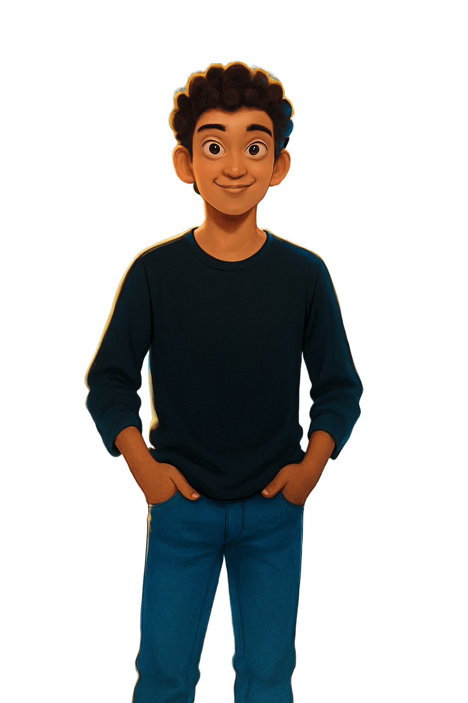

<!DOCTYPE html>
<html lang="en">
<head>
    <meta charset="UTF-8">
    <meta name="viewport" content="width=device-width, initial-scale=1.0">
    <title>Tharindu Dasantha - Portfolio</title>
    <link rel="preconnect" href="https://fonts.googleapis.com">
    <link rel="preconnect" href="https://fonts.gstatic.com" crossorigin>
    <link href="https://fonts.googleapis.com/css2?family=Inter:wght@300;400;600;700;800&display=swap" rel="stylesheet">
    <link rel="stylesheet" href="https://cdnjs.cloudflare.com/ajax/libs/font-awesome/5.15.4/css/all.min.css">
    
</head>
<body>
    

        

            

                
            

        

        

            
UI/UX DESIGN • WEB DEVELOPMENT

            

                Tharindu  
                Dasantha
            

            
Full Stack Web Developer

            

                <button>Portfolio</button>
                <button>Behance</button>
            

            
            

            

        

        

            <h2>Who am I ?...</h2>
            

                From Sri Lanka, I'm a dynamic professional excelling as both a <b>UI/UX Designer</b> and <b>Full Stack Developer</b>. My expertise spans <i>Web Development</i>, intuitive <i>UI/UX Design</i>, and robust <i>System Programming</i>, all guided by my belief that "Simplicity is the ultimate sophistication." I'm continuously expanding my knowledge in <b>Advanced React Patterns</b>, <b>System Design</b>, and <b>WebGL</b>, proving that even a `console.log` enthusiast can be a highly skilled developer.
            

            
            

                <i class="fas fa-globe"></i>
            

        

        

            <h3>BRIEF EXPLANATION ABOUT GALAXIES</h3>
            

                

                    

                        Galaxies are typically grouped into galaxy clusters or superclusters, forming the largest known structures in the universe. These galaxies can collide through gravitational forces, which may lead to shifts or mergers of galaxies.
                    

                    <button>
                        <i class="fas fa-arrow-right"></i> Continue...
                    </button>
                    
                

                

                    

                        Galaxies are typically grouped into galaxy clusters or superclusters, forming the largest known structures in the universe. These galaxies can collide through gravitational forces, which may lead to shifts or mergers of galaxies.
                    

                    <button>
                        <i class="fas fa-arrow-right"></i> That's enough.
                    </button>
                    
                

            

            

                
<i class="fas fa-bookmark"></i>

                
<i class="fas fa-comments"></i>

                
<i class="fas fa-share-alt"></i>

                
<i class="fas fa-cog"></i>

            

            
        

        

            SCROLL  
            <i class="fas fa-arrow-down"></i>
        

        

            

                
                <button><i class="fas fa-arrow-right"></i></button>
            

            

                
                <button><i class="fas fa-arrow-right"></i></button>
            

            

                
                <button><i class="fas fa-arrow-right"></i></button>
            

            

                
                <button><i class="fas fa-arrow-right"></i></button>
            

            

                
                <button><i class="fas fa-plus"></i></button>
            

        

        

            CREATED BY MUHAMMAD FAJRI
        

    

</body>
</html>